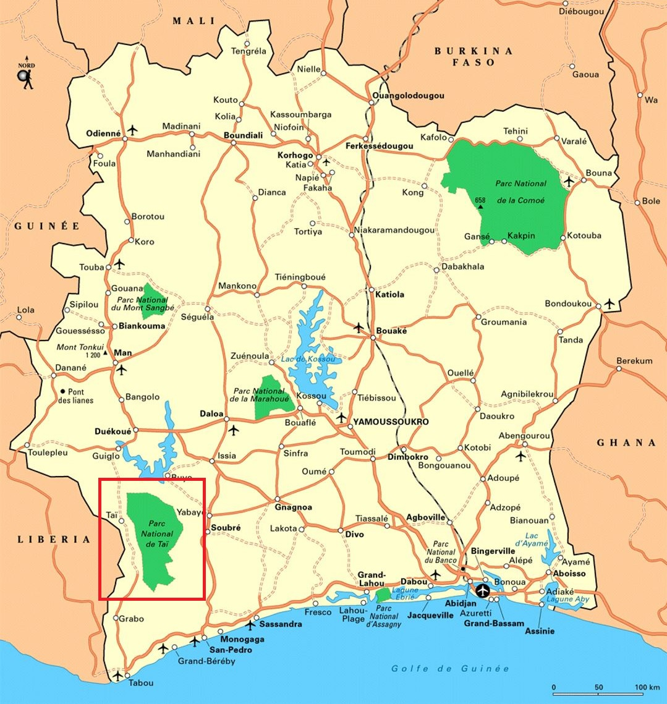
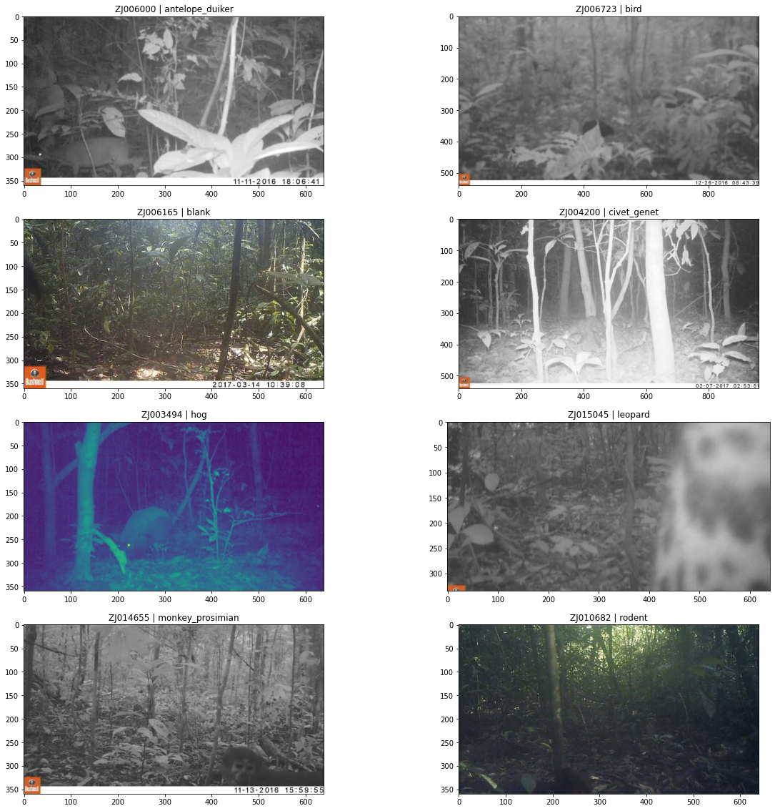
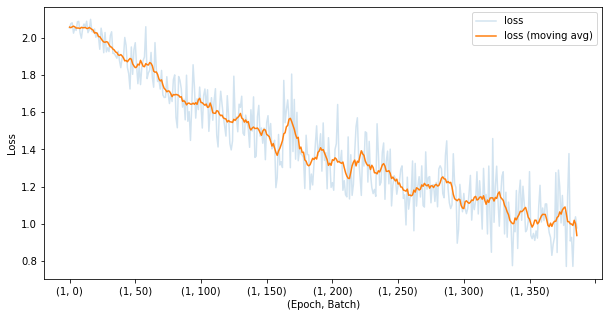
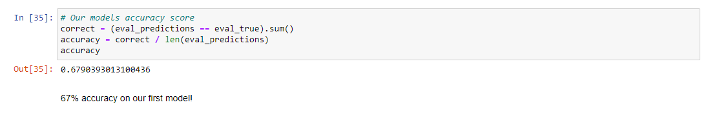
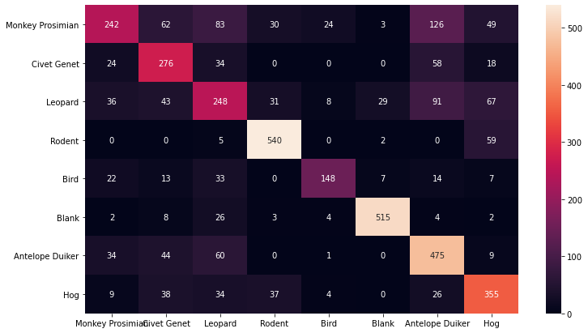
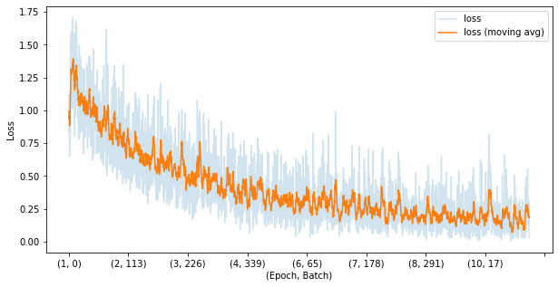
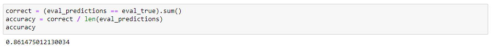
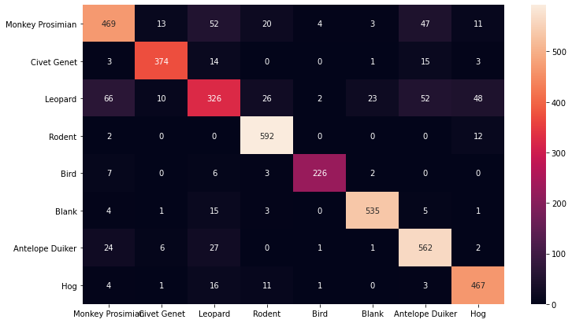

# Taï National Park:
# Using Machine Learning to Enhance Multi-Image Classification



For this capstone project, I worked with a hypothetical client Taï National Park to help analyze over 16,500 still images from 8 image classes to create a multi-image classification model that would help their researchers correctly identify the image class. With my analysis and modeling, my stakeholder Taï National Park can use my data driven insights to help identify poor performing camera traps and accurately identify local wildlife for their ebola virus research.

## Business Objective
With the number of photos that camera traps can take increasing as technology in the field gets better and better, it is more important than ever that NGOs and Research Organizations find ways to keep their scientists and researchers doing what they were hired to do. In the Taï National Parks case, they are studying the local Ebola Virus variant to find out how it came to the National Park and how it is transmitted. Through this image classification model, researchers will be heading towards a system where they can touch one button and sort through thousands of images accurately. This way they will be able to get back to their focus on discovering how Ebola came to be and how it transmits inside of Taï National Park.

## Main Findings
In the analysis of the 16,500+ images, there are three main recommendations found for this project:  

1. The best model to use is a Convolutional Neural Network.  
2. For the Ebola Virus Project, prioritize models on the animal of interest.  
  * For example, create a binary classification for Western Chimpanzees (a common spreader of the local Ebola Virus) and everything else.  
3. Set a Probability Threshold for Images.  
  * I.e. send tougher images to a trained analyst.  

My final CNN based image classification system has an overall accuracy of 86%. This means that if an image is provided to my model, it has an 86% probability of correctly identifying the image. As a side note, this breakdown does change between image classes with blank images having a 95% accuracy score for example.

## The Notebooks
This project is completed through the jupyter notebook labeled as `main_notebook.ipynb`.

## Dataset
The dataset can be found [here](https://www.drivendata.org/competitions/87/competition-image-classification-wildlife-conservation/page/409/) and can be downloaded in a zipped folder. The dataset inside of this folder are:

Test_features.csv, train_features.csv, and train_labels.csv.

This dataset came with fully completed annotations for each of the image classifications. A future step that I wish to do with this dataset is to try and rotate/flip the images to see if this will increase model performance. After the images and labels were imported I then decided to view a few of these pictures.

## EDA
As previously stated there are 8 image classes in this dataset, with those 8 being labeled as:  
`antelope_duiker`  
`bird`  
`blank`  
`civet_genet`  
`hog`  
`leopard`  
`monkey_prosimian`  
`rodent`  



 
 
I also took a look at the size of the dataset, which was found to be `16488.0`.
 
After finding the total size of the dataset, I wanted to take a look at each class to see if we might have a potential imbalanced dataset.
 
Sum of each class:  
`monkey_prosimian    2492.0`  
`antelope_duiker     2474.0`  
`civet_genet         2423.0`  
`leopard             2254.0`  
`blank               2213.0`  
`rodent              2013.0`  
`bird                1641.0`  
`hog                  978.0`  
 
Percentage of each class:  
`monkey_prosimian    0.151140`  
`antelope_duiker     0.150049`  
`civet_genet         0.146955`  
`leopard             0.136705`  
`blank               0.134219`  
`rodent              0.122089`  
`bird                0.099527`  
`hog                 0.059316`  
 
 
## Image Classification Modeling
For my classification modeling we started off with my baseline model, or the bare minimum accuracy that we had to beat. The baseline model for this image classification is going to be if we randomly guessed 1 of the animal classes for every image. This would give us an accuracy of 12.5% (1/8). We could also use the `monkey_prosimian 0.151140%` (its weight in the dataset) for an 15.11% accuracy. 
 
We then moved to an initial convolutional neural net model with 1 epoch followed with a model with an epoch of 10. My first CNN model had an overall accuracy of 67% with my final model having an overall accuracy of 86%. Due to the length of processing time this took, a decision was made to finalize my model on the second attempt to ensure that a minimum viable product could be created to finalize this capstone project. The best model found is the one that uses 10 epochs for its learning. This improved my accuracy from 15% to a final 86%.
 
### Epoch 1 Model
 

 

 

 
### Epoch 10 Model
 

 

 

 
## Recommendations and conclusions for Taï National Park
Overall, I recommend that Taï National Park focus their efforts on developing a CNN Model, with prioritizing a single animal (Western Chimpanzee), and to create a probability to filter tougher images to a trained analyst. 
 

## Future Investigations
This section goes into a few things I was interested in, but unfortunately didn’t have the time to develop or investigate further. 

1. Adding more animals into the dataset. There are 5 animals that are classified as being in extreme danger, and these could be added to the set in an attempt to follow them more closely to ensure their health and vitality.  
2. Develop an analysis for moving images and videos. This model was developed on still images and could not be applied if there are cameras that capture movement.   
3. Tracking movement patterns of specific animal groups. For example, develop a way to use the location of the camera and see if there is a hypothetical trail that can be created to see where the animal has moved to within the park.  
 
## For More Information
Please review my full analysis in [my Jupyter Notebook](./main_notebook.ipynb) or my [presentation](./presentation.pdf).
 
For any additional questions, please contact **Mackoy Staloch | mackoy.staloch@gmail.com**
 
## Repository Structure
```
├── README.md                       <- The top-level README for reviewers of this project
├── main_notebook.ipynb             <- Narrative documentation of analysis in Jupyter notebook
├── presentation.pdf                <- PDF version of project presentation
├── data                            <- Both sourced externally and generated from code
└── images                          <- Both sourced externally and generated from code
```
